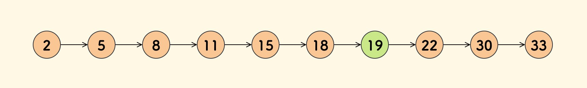
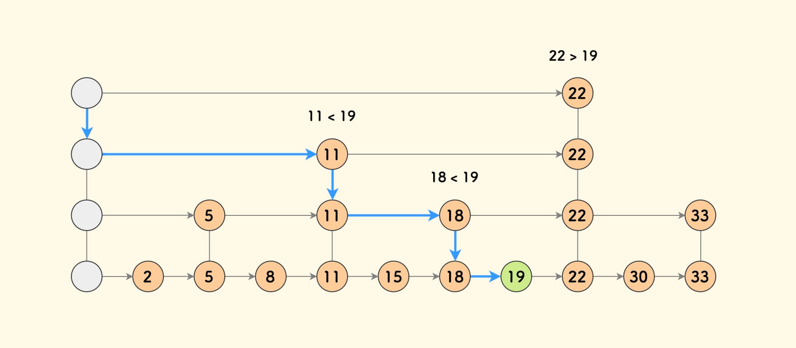
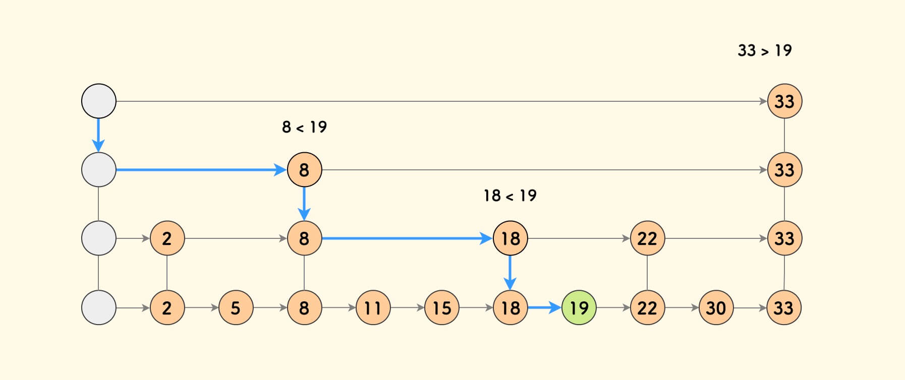
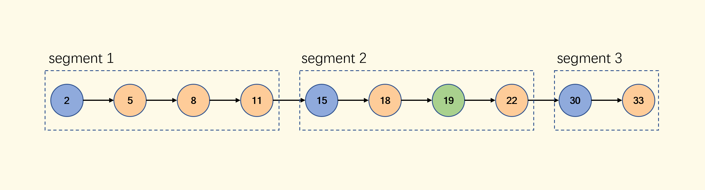
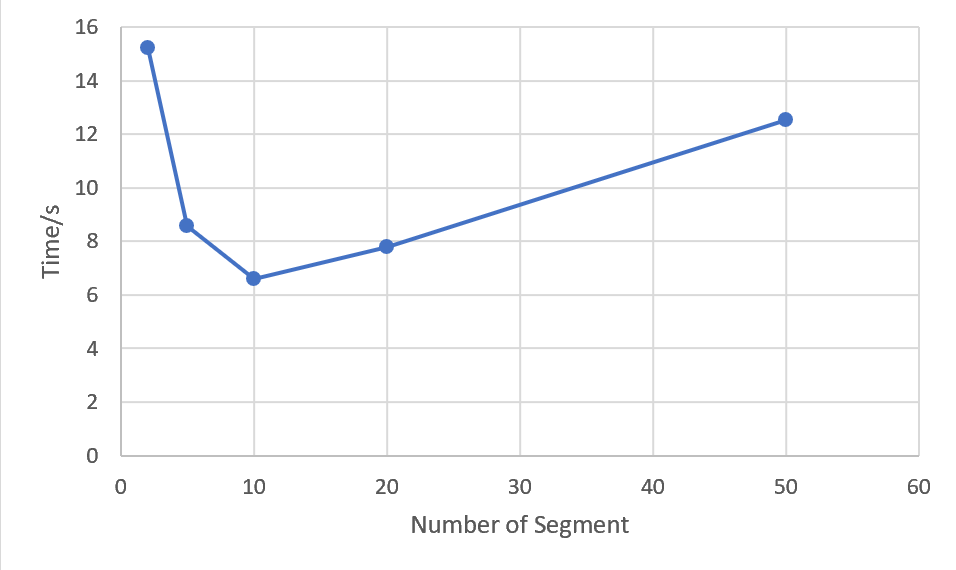
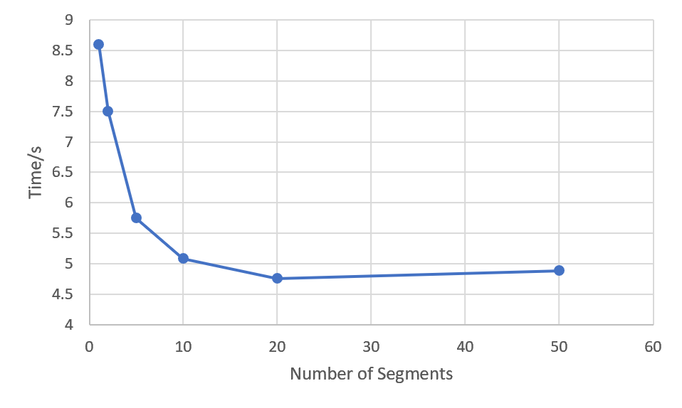
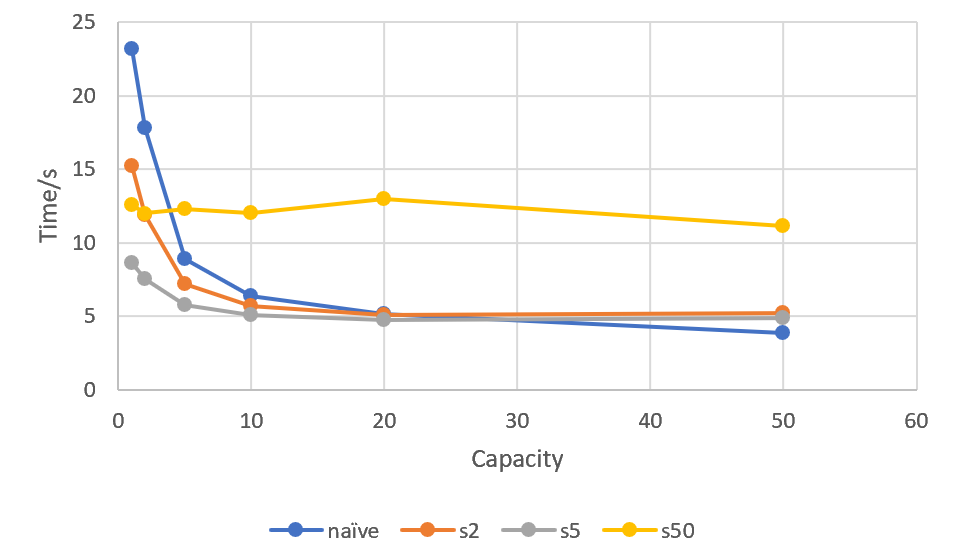

# Final Project of Multicore Processors: Architecture & Programming

## Abstract

Hash tables are efficient data structures but can suffer significant performance degradation under high collision rates when multiple keys map to the same index, leading to lengthy linked lists and slower searches. This project introduces a novel hash table implementation using a Segmented Singly Linked List inspired by skip lists, where each linked list is divided into segments with pointers stored in a pivot array. By leveraging OpenMP for parallel processing, search operations are distributed across multiple threads, each handling a different segment, effectively reducing search times in high-collision buckets. Experiments on a high-performance computing server demonstrate that our segmented implementation significantly outperforms a naive hash table in high-collision scenarios, especially at lower capacities, with optimal performance achieved using segment sizes that balance parallelism and overhead. Our approach enhances hash table efficiency in multi-threaded environments where collisions are prevalent.

## Introduction

In the realm of computer science and data structures, a hash table is a critical data structure that enables efficient data retrieval. In general, the hash table provides an average-case time complexity of $ O(1) $ for search, insert, and delete operations, making it an indispensable tool for applications that require quick data access. Hash tables achieve this efficiency by using a hash function to map keys to indices in an array, allowing for near-instantaneous data retrieval. However, in scenarios where hash conflicts are very serious, the time complexity of related operations may be very large. Our project is dedicated to solving this problem.

### Hash Table

A hash table, also known as a hash map, is a data structure that stores key-value pairs. It uses a hash function to compute an index into an array of buckets or slots, from which the desired value can be found. The hash function converts the key into a hash code, which is then compressed into an index suitable for the array's size. This process allows for rapid data access because it narrows down the search area to a specific index rather than searching through an entire dataset.

Hash tables are versatile and are used in various scenarios, including:

- Databases: For indexing data to allow quick retrieval.
- Caching Mechanisms: To store frequently accessed data for faster access.
- Symbol Tables: In compilers and interpreters to keep track of declared variables and their attributes.
- Networking: For routing tables and managing network resources.
- Applications with Constant-Time Lookup Requirements: Such as spell checkers, dictionaries, and language processing tools.

In today's data-driven world, the ability to store and retrieve data efficiently is more crucial than ever. Hash tables play a vital role in applications that require fast data access and manipulation. With the exponential growth of data, optimizing search and retrieval operations can significantly impact the performance and scalability of software systems. Hash tables offer a solution that balances speed and memory usage, making them essential for modern computing tasks.

As computing moves towards multi-core and distributed systems, parallel programming has become increasingly important. Hash tables, when adapted for parallelism, can greatly enhance the performance of concurrent applications. Implementing a hash table that supports multi-threaded operations involves addressing challenges such as synchronization, data consistency, and avoiding race conditions.

In a parallel environment, hash tables can be designed to allow multiple threads to perform operations simultaneously without interfering with each other. Techniques such as lock-free programming, fine-grained locking, and partitioning the hash table into segments (as in our implementation) are employed to achieve thread safety and improve performance. By enabling concurrent access, hash tables become more efficient and scalable in multi-threaded applications.

### Hash Collisions

A hash collision occurs when two different keys produce the same hash code using a hash function. In other words, the hash function maps multiple keys to the same index in the hash table. Since a hash table uses the hash code to determine where to store or retrieve a key-value pair, collisions can lead to ambiguity and potential errors in data retrieval.

Avoiding hash collisions is essential for maintaining the efficiency and reliability of a hash table. High collision rates can degrade the performance of the hash table from $ O(1) $ to $ O(n) $ in the worst case, where $ n $ is the number of elements in the table. This degradation occurs because the hash table must resolve collisions, often by traversing a list of colliding entries, which increases the time complexity of operations.

Furthermore, excessive collisions can lead to uneven distribution of data within the hash table, causing some slots to be overloaded while others remain unused. This imbalance not only affects performance but can also lead to increased memory usage and potential issues with thread contention in parallel implementations.

## Literature Survey

### Collision Resolution

Hash tables are essential data structures for efficient key-value mappings. However, hash collisions, where two keys map to the same index, present inherent challenges. Effective collision resolution strategies ensure the continued efficiency of hash tables. This report examines three common techniques for handling collisions: Open Addressing, Chaining, and Dynamic Arrays.

| Technique           | Best For                               | Not Ideal For                            | Performance Under High Load |
|---------------------|-----------------------------------------|------------------------------------------|-----------------------------|
| **Open Addressing** | Memory-limited systems with low load factors (<70%). | Frequent insertions or deletions (clustering issues). | Degrades as the table fills up. |
| **Chaining**        | High or unpredictable load factors.     | Memory-constrained environments.         | Resilient but resizing can be costly. |
| **Dynamic Arrays**  | Sequential access and frequent appends.| Frequent deletions or random insertions. | Effective, but resizing introduces overhead. |

#### Open Addressing

Open Addressing is a collision resolution technique for hash tables that keeps all data within the primary array. Instead of using external data structures like linked lists or arrays (as in chaining), open addressing handles collisions by searching for another empty slot within the hash table itself. When a collision occurs at a given index, the method probes the table according to a specific strategy to find the next available slot.

One common approach is Linear Probing, where the table is searched sequentially from the point of collision. For instance, if a collision occurs at index $i$, the method checks indices $i+1, i+2$, and so on, until an empty slot is found. While simple and efficient in terms of memory usage, linear probing often suffers from a phenomenon known as primary clustering, where consecutive filled slots increase the likelihood of collisions and degrade performance.

Another approach is Quadratic Probing, which mitigates primary clustering by probing non-linearly. Instead of checking the next sequential slot, quadratic probing increases the probe interval quadratically, such as checking indices $i+1^2, i+2^2, \dots$. This spreads the probes more widely across the table, reducing the chances of clustering. However, quadratic probing can still result in secondary clustering, where keys with the same initial hash value follow identical probing patterns. Careful selection of table size, often a prime number, is required to ensure that an empty slot can always be found.

Double Hashing takes this a step further by using a second hash function to calculate the probe step size. This technique offers the most uniform distribution of probes, minimizing clustering of any kind. However, it requires high-quality hash functions and more complex implementation compared to the other probing methods.

In open addressing, the table's performance heavily depends on its load factor, which is the ratio of occupied slots to the total number of slots. As the load factor increases, the time taken to resolve collisions rises significantly. To maintain efficiency, it is common to resize the table when the load factor exceeds a certain threshold (e.g., 0.75). The new table is typically larger, and all elements are rehashed into the resized table.

Overall, open addressing is memory-efficient and avoids external data structures, but its performance is sensitive to the load factor and the quality of the hash functions used.

#### Chaining

Chaining is a collision resolution technique for hash tables that stores all elements with the same hash index in a secondary data structure, typically a linked list. When a collision occurs, the new element is appended to the list located at the corresponding index of the hash table. This allows multiple elements to occupy the same slot in the table, resolving collisions efficiently.

One of the key strengths of chaining is its ability to handle high or unpredictable load factors. Unlike open addressing, where performance degrades as the hash table fills up, chaining can continue to operate effectively even when the load factor exceeds 1, as the number of elements stored in each bucket is not limited by the table size. This makes chaining particularly suitable for applications where the number of keys is dynamic or where uniform distribution of hash values is not guaranteed.

However, chaining has its drawbacks. The use of secondary data structures, such as linked lists, increases memory overhead due to the additional pointers needed to link elements. In worst-case scenarios, where all keys hash to the same index, the linked list at that bucket grows long, degrading the time complexity of search, insertion, and deletion operations to $O(n)$, where $n$ is the number of elements in that bucket.

To improve performance under high collision rates, modern implementations of chaining often replace linked lists with more efficient data structures, such as dynamic arrays or self-balancing binary trees. Dynamic arrays provide faster traversal and allow efficient use of memory, while self-balancing trees ensure logarithmic performance for operations even in the worst case.

Another advantage of chaining is its flexibility. Since the hash table itself only needs to maintain pointers to the heads of the chains, there is no strict limit on the number of elements that can be stored, aside from memory constraints. This makes it suitable for use cases where the size of the dataset is difficult to predict.

Overall, chaining is a robust collision resolution technique that trades off some memory efficiency for resilience against high load factors and flexible capacity. While its performance can degrade in extreme cases, optimizations like balanced trees or dynamic arrays help mitigate these issues, making chaining a popular choice for many applications.

#### Dynamic Array

Dynamic Arrays are a type of data structure that allows arrays to automatically adjust their size to accommodate changing data. Unlike static arrays, which have a fixed size, dynamic arrays can expand or shrink as needed. This flexibility is achieved through resizing: when the array reaches its capacity, a larger array is allocated (typically double the size of the current one), and all existing elements are copied to the new array. Similarly, when the number of elements drops significantly, the array can shrink to save memory.

The primary advantage of dynamic arrays is their ability to provide efficient, sequential access. Elements can be accessed in constant time $(O(1)$) using their indices, making them ideal for use cases where frequent appending or indexed retrieval is required. Additionally, they use memory compactly since no extra pointers are required, unlike linked lists or other data structures.

However, resizing operations can be costly. When the array grows or shrinks, the process of allocating new memory and copying existing elements introduces significant overhead, especially if the array is large. This makes insertion operations occasionally expensive. Still, the amortized cost of insertions remains constant $(O(1)$), as resizing happens infrequently relative to the number of insertions.

Dynamic arrays also suffer from potential wasted space. After a resize operation, the array often has unused capacity until new elements are added. This trade-off ensures that insertions remain efficient but can lead to higher memory usage in scenarios where growth is unpredictable.

To mitigate these issues, dynamic arrays employ strategies like amortized growth and threshold-based contraction. Amortized growth ensures that the capacity doubles during resizing, reducing the number of resizing operations over time. Threshold-based contraction prevents frequent shrinking and growing, which could lead to performance bottlenecks in cases where the number of elements fluctuates.

While dynamic arrays excel in scenarios involving frequent appends and sequential access, they are less suited for frequent deletions or random insertions. These operations require shifting elements, which can degrade performance to $O(n)$ in the worst case.

Overall, dynamic arrays offer a flexible and efficient solution for managing variable-sized datasets. Their balance of memory efficiency, fast sequential access, and amortized performance makes them a popular choice in applications such as stacks, queues, and general-purpose collections.


## Proposed Idea

In designing efficient data structures for parallel computing, it's crucial to balance simplicity with performance. Our approach builds upon the fundamental characteristics of linked lists and integrates concepts inspired by skip lists to enhance search efficiency in a multi-threaded environment.



<center> Fig 1: A simple singly lined list. </center>

### What is a Skip List?

A skip list is a probabilistic data structure that allows fast search within an ordered sequence of elements. Invented by William Pugh in 1989, skip lists are an alternative to balanced trees, providing similar time complexities for operations but with simpler implementation and maintenance.

#### Structure of a Skip List

A skip list consists of multiple levels of linked lists:

- Levels: Each level in a skip list is a linked list that contains a subset of elements from the level below.
- Nodes: Each node may have multiple forward pointers, one for each level it appears in.
- Hierarchy: The bottom level (level 0) contains all the elements, forming a standard sorted linked list. Each higher level acts as an "express lane," allowing the algorithm to skip over multiple elements during search.



<center> Fig 2: A uniformly distributed constructed skip list equivalent to Fig 1. Blue path shows the search process for 19. </center>

#### How Skip Lists Work

- Insertion: When inserting a new element, it's randomly assigned a level. The element is then inserted into all levels up to its assigned level.
- Search:
  1. Start at the top level: Begin with the highest level of the skip list.
  2. Move forward: At each node, compare the target key with the key of the next node.
     - If the next key is less than or equal to the target, move to that node.
     - If the next key is greater, drop down one level and repeat.
  3. Terminate: Continue this process until the target is found or confirmed absent.
- Deletion: Similar to insertion, remove the node from all levels where it appears.



<center> Fig 3: A randomized probability distribution constructed skip list equivalent to Fig 1. Blue path here also shows the search process for 19. </center>

#### Advantages of Skip Lists

- Simplicity: Easier to implement than balanced trees.
- Probabilistic Balancing: Avoids the need for strict balancing rules, as in AVL or Red-Black trees.
- Flexibility: Good performance for a wide range of operations without complex rebalancing.

### Our Concept: Segmented Singly Linked List

We found that many applications are read-intensive. So, our structure focus on accelerating search operations, which are critical for performance in such scenarios. Leveraging the simplicity of linked lists and inspired by the efficiency of skip lists, we propose a hash table with Segmented Singly Linked List data structure. Our implementation divides a standard singly linked list into several segments, with the starting node of each segment stored in a pivot array (referred to as `segments` in the code). This segmentation allows us to parallelize search operations by assigning each segment to a separate thread, significantly improving query speed in multi-threaded applications. Also, it greatly reduces the index maintenance required for insertion and deletion operations in the skip list. 



<center> Fig 4: Our implemented singly linkded list equivalent to Fig 1. Blue node here indicates the pivot node for segmentSize=3. </center>

#### Key Components:

- Singly Linked List: The foundational data structure, chosen for its simplicity and efficient insertion operations.
- Segments: The linked list is partitioned into segments of approximately equal size, determined by a predefined `segmentSize`.
- Pivot Array: An array (`segments`) that holds pointers to the starting node of each segment.
- Parallel Processing: Search operations are parallelized by assigning each segment to a separate thread using OpenMP.

### Detailed Operations

#### Insert Operation (`insertAtTail`)

The `insertAtTail` function adds a new node to the end of the linked list.

1. Node Creation: A new node is created with the given key and value.
2. Insertion:
   - If the list is empty (`tail` is `nullptr`), both `head` and `tail` point to the new node.
   - Otherwise, the new node is appended after the `tail`, and `tail` is updated to the new node.
3. Segment Maintenance:
   - The `size` of the list is incremented.
   - If the number of segments is less than the `segmentSize`, new segments are added.
   - If the list size exceeds the current segments, segments are adjusted to include new nodes.
   - We make sure that the valid segments all have the same size.

#### Remove Operation (`remove`)

The `remove` function deletes a node with the specified key from the linked list.

1. Search: Utilizes the `searchWithPrev` function to find the node to remove and its predecessor.
2. Deletion:
   - If the node is found, it's removed by adjusting the `next` pointer of the predecessor.
   - If the node is the `head`, the `head` is updated to the next node.
   - If the node is the `tail`, the `tail` is updated to the predecessor.
3. Segment Rebuilding:
   - After deletion, the `segments` vector is cleared and rebuilt to reflect the updated list structure.

#### Update Operation (`update`)

The `update` function modifies the value of a node with a given key.

1. Search: Calls the `search` function to locate the node.
2. Update:
   - If the node is found, its `value` is updated to the new value.
   - Returns `true` upon successful update.

#### Search Operation (`search` and `searchWithPrev`)

The `search` function locates a node with a specific key, while `searchWithPrev` also provides the predecessor node, useful for deletion.

1. Parallel Processing:
   - The list is divided into segments, each assigned to a thread using OpenMP's `#pragma omp parallel for`.
   - Each thread searches within its assigned segment.
2. Searching:
   - Each thread iterates through nodes in its segment.
   - If the key is found, a flag (`stop`) is set to terminate other threads' searches.
3. Synchronization:
   - A critical section (`#pragma omp critical`) ensures that only one thread updates the result at a time.
   - The search stops early if another thread has already found the key.

### Analysis of Our Implementation

Our implementation offers several performance benefits over traditional singly linked lists and even some other parallel data structures:

1. Improved Search Performance:
   - By parallelizing the search operation across multiple segments, we reduce the time complexity from $ O(n) $ to $ O(n/p) $, where $ p $ is the number of threads (segments).
   - The use of segments allows each thread to work independently. By dividing the list into segments and processing them in parallel, we exploit the full potential of multi-core systems, which minimizing contention.

2. Simplicity and Maintainability:
   - Retains the simplicity of a singly linked list, making it easy to understand and maintain.
   - Segment management adds minimal overhead to insertion and deletion operations.
   - Since each thread operates on a different segment, there's minimal need for synchronization, reducing overhead.

3. Scalability:
   - The approach scales with the number of available processors.
   - As the data size grows, more segments (and thus threads) can be utilized to maintain performance.

4. Flexibility:
   - The `segmentSize` can be adjusted based on the application requirements and hardware capabilities.
   - The structure can be extended or modified for additional functionalities as needed.

## Experimental Setup

To evaluate the performance of our proposed segmented singly linked list implementation in a hash table, we conducted a series of experiments under controlled conditions. This section details the hardware and software environment, the compilation settings, and the specific experimental configurations used during testing.

### Hardware Environment

All experiments were performed on the crunchy1 server at the Courant Institute of Mathematical Sciences (CIMS). The server's specifications are as follows:

```bash
$ lscpu
Architecture:             x86_64
  CPU op-mode(s):         32-bit, 64-bit
  Address sizes:          48 bits physical, 48 bits virtual
  Byte Order:             Little Endian
CPU(s):                   64
  On-line CPU(s) list:    0-63
Vendor ID:                AuthenticAMD
  Model name:             AMD Opteron(TM) Processor 6272
    CPU family:           21
    Model:                1
    Thread(s) per core:   2
    Core(s) per socket:   8
    Socket(s):            4
    Stepping:             2
    BogoMIPS:             4200.00
    Flags:                fpu vme de pse tsc msr pae mce cx8
                           apic sep mtrr pge mca cmov pat ps
                          e36 clflush mmx fxsr sse sse2 ht s
                          yscall nx mmxext fxsr_opt pdpe1gb
                          rdtscp lm constant_tsc rep_good no
                          pl nonstop_tsc cpuid extd_apicid a
                          md_dcm aperfmperf pni pclmulqdq mo
                          nitor ssse3 cx16 sse4_1 sse4_2 pop
                          cnt aes xsave avx lahf_lm cmp_lega
                          cy svm extapic cr8_legacy abm sse4
                          a misalignsse 3dnowprefetch osvw i
                          bs xop skinit wdt fma4 nodeid_msr
                          topoext perfctr_core perfctr_nb cp
                          b hw_pstate ssbd ibpb vmmcall arat
                           npt lbrv svm_lock nrip_save tsc_s
                          cale vmcb_clean flushbyasid decode
                          assists pausefilter pfthreshold
Virtualization features:
  Virtualization:         AMD-V
Caches (sum of all):
  L1d:                    1 MiB (64 instances)
  L1i:                    2 MiB (32 instances)
  L2:                     64 MiB (32 instances)
  L3:                     48 MiB (8 instances)
NUMA:
  NUMA node(s):           8
  NUMA node0 CPU(s):      0-7
  NUMA node1 CPU(s):      8-15
  NUMA node2 CPU(s):      32-39
  NUMA node3 CPU(s):      40-47
  NUMA node4 CPU(s):      48-55
  NUMA node5 CPU(s):      56-63
  NUMA node6 CPU(s):      16-23
  NUMA node7 CPU(s):      24-31
Vulnerabilities:
  Gather data sampling:   Not affected
  Itlb multihit:          Not affected
  L1tf:                   Not affected
  Mds:                    Not affected
  Meltdown:               Not affected
  Mmio stale data:        Not affected
  Reg file data sampling: Not affected
  Retbleed:               Mitigation; untrained return thunk
                          ; SMT vulnerable
  Spec rstack overflow:   Not affected
  Spec store bypass:      Mitigation; Speculative Store Bypa
                          ss disabled via prctl
  Spectre v1:             Mitigation; usercopy/swapgs barrie
                          rs and __user pointer sanitization
  Spectre v2:             Mitigation; Retpolines; IBPB condi
                          tional; STIBP disabled; RSB fillin
                          g; PBRSB-eIBRS Not affected; BHI N
                          ot affected
  Srbds:                  Not affected
  Tsx async abort:        Not affected                   
```

This high-performance computing environment provides ample resources to effectively test the scalability and efficiency of our parallelized data structure.

### Software Environment

- Operating System: Linux, kernel version 5.14.0-503.11.1.el9_5.x86_64

  ```bash
  $ uname -a
  Linux crunchy1.cims.nyu.edu 5.14.0-503.11.1.el9_5.x86_64 #1 SMP PREEMPT_DYNAMIC Mon Sep 30 11:54:45 EDT 2024 x86_64 x86_64 x86_64 GNU/Linux
  ```
  
- Compiler: GNU Compiler Collection (GCC) version 11.5.0 (Red Hat 11.5.0-2)

  ```bash
  $ g++ --version
  g++ (GCC) 11.5.0 20240719 (Red Hat 11.5.0-2)
  ```
  
- Programming Language: C++ (C++17 standard)

- Parallelization Library: OpenMP for multi-threading support

### Compilation Settings

To ensure consistency and optimize performance, all code was compiled using the following command:

```bash
g++ -O1 -fopenmp -std=c++17
```

- `-O1`: Enables a basic level of optimization without compromising debugging capabilities.
- `-fopenmp`: Enables the OpenMP API for multi-threaded parallelism.
- `-std=c++17`: Specifies the use of the C++17 standard for modern language features.

We deliberately chose `-O1` optimization to balance between execution speed and the ability to debug the code effectively. Higher optimization levels (`-O2`, `-O3`) may interfere with debugging and were thus avoided during this experimental phase.

### Experimental Configurations

The experiments were designed to assess the performance of our implementation under varying conditions. Two primary variables were manipulated:

#### Experiment 1: Evaluating Collision Handling with Varying Capacities

In this experiment, we aimed to assess how different hash table capacities affect performance under varying levels of hash collisions. By using the same input dataset across all tests, we ensured consistency in our measurements. We adjusted the capacity of the hash table to control the load factor, which directly influences the frequency of hash collisions—smaller capacities lead to higher collision rates, while larger capacities reduce them. We tested multiple hash table implementations, including our own and standard versions, to compare their running times under these different collision conditions. This allowed us to evaluate each implementation's ability to handle collisions effectively.

#### Experiment 2: Assessing the Impact of Thread Count on Performance

The second experiment focused exclusively on our proposed hash table implementation. We kept the input dataset and hash table capacity constant to isolate the effect of threading on performance. By varying the number of threads, we measured how the running time of our hash table operations changed with increased parallelism. This experiment aimed to determine the scalability of our implementation and how effectively it leverages multi-threading to improve performance. By analyzing the results, we could understand the impact of different thread counts on the efficiency of our data structure.

## Experiments & Analysis

### Experiments Results

We generate a random input with 20000 input operations and 200000 search operations. The following table summarizes the running times of the naive and segmented hash table implementations under various capacities and segment sizes:

| Version    | Capacity | Segment Size | Time (s) |
|------------|----------|--------------|----------|
| Naive  | 1        | -            | 23.19    |
| Segmented  | 1        | 2            | 15.22    |
| Segmented  | 1        | 5            | 8.59     |
| Segmented  | 1        | 10           | 6.59     |
| Segmented  | 1        | 20           | 7.80     |
| Segmented  | 1        | 50           | 12.55    |
| Naive  | 2        | -            | 17.83    |
| Segmented  | 2        | 2            | 11.90    |
| Segmented  | 2        | 5            | 7.50     |
| Segmented  | 2        | 10           | 7.97     |
| Segmented  | 2        | 20           | 10.60    |
| Segmented  | 2        | 50           | 11.98    |
| Naive  | 5        | -            | 8.90     |
| Segmented  | 5        | 2            | 7.18     |
| Segmented  | 5        | 5            | 5.75     |
| Segmented  | 5        | 10           | 5.56     |
| Segmented  | 5        | 20           | 6.81     |
| Segmented  | 5        | 50           | 12.31    |
| Naive  | 10       | -            | 6.36     |
| Segmented  | 10       | 2            | 5.70     |
| Segmented  | 10       | 5            | 5.08     |
| Segmented  | 10       | 10           | 5.37     |
| Segmented  | 10       | 20           | 6.96     |
| Segmented  | 10       | 50           | 12.00    |
| Naive  | 20       | -            | 5.13     |
| Segmented  | 20       | 2            | 5.09     |
| Segmented  | 20       | 5            | 4.75     |
| Segmented  | 20       | 10           | 5.33     |
| Segmented  | 20       | 20           | 6.64     |
| Segmented  | 20       | 50           | 12.98    |
| Naive  | 50       | -            | 3.82     |
| Segmented  | 50       | 2            | 5.18     |
| Segmented  | 50       | 5            | 4.88     |
| Segmented  | 50       | 10           | 5.33     |
| Segmented  | 50       | 20           | 6.57     |
| Segmented  | 50       | 50           | 11.15    |

### Analysis of Results

#### Impact of Capacity on Performance

**Observation 1**: As the capacity of the hash table increases, the running time for both the naive and segmented implementations decreases.

Increasing the capacity reduces the load factor (ratio of elements to buckets), thereby decreasing the collision rate. With fewer collisions, the average length of the linked lists in each bucket shortens, leading to faster search and insertion operations.

**Observation 2**: The performance improvement is more significant in the naive implementation as capacity increases.

The naive implementation benefits directly from reduced collision rates because its linked lists become shorter, and there's minimal overhead. In contrast, the segmented implementation introduces additional overhead for segment management and parallelization, which may not be fully offset by performance gains at higher capacities.

#### Comparison Between Naive and Segmented Implementations

**Observation 3**: At lower capacities (1, 2, 5, 10), the segmented implementation outperforms the naive implementation for certain segment sizes.

 In scenarios with high collision rates (low capacities), the linked lists in each bucket are longer. The segmented implementation leverages parallelism to divide the long linked lists into segments that can be searched concurrently, thus reducing the overall search time.

**Observation 4**: At higher capacities (20, 50), the naive implementation often matches or outperforms the segmented implementation.

With higher capacities, the linked lists are shorter due to fewer collisions, diminishing the benefits of parallelizing the search over segments. Additionally, the overhead associated with managing segments and threads in the segmented implementation may outweigh its advantages when the data is already efficiently organized.

#### Effect of Segment Size on Segmented Implementation

**Observation 5**: There is an optimal segment size that yields the best performance for the segmented implementation, typically around segment sizes of 5 or 10.

Segment size determines the number of segments and, consequently, the level of parallelism. A smaller segment size increases the number of segments (and threads), enhancing parallelism but also introducing more overhead due to thread management and synchronization. Conversely, a larger segment size reduces parallelism and may lead to longer per-thread processing times.

**Observation 6**: Very small (e.g., segment size 2) or very large segment sizes (e.g., segment size 50) result in poorer performance.

While they maximize parallelism, the overhead of managing a large number of threads can degrade performance. Context switching and synchronization costs become significant.

Reduced parallelism means that each thread handles a larger portion of the list, diminishing the benefits of concurrent execution. Additionally, larger segments may lead to imbalance if the workload is not evenly distributed.

#### Overall Performance Trends

High Collision Rates (Low Capacities):
- The segmented implementation significantly reduces running times compared to the naive implementation, with optimal segment sizes around 5 or 10.
- Example: At capacity 1 (all elements in one bucket), the naive implementation takes 23.19s, whereas the segmented implementation with a segment size of 10 takes 6.59s, representing a 71.6% reduction in running time.

Low Collision Rates (High Capacities):
- The naive implementation becomes more efficient, sometimes outperforming the segmented version due to lower overhead.
- Example: At capacity 50, the naive implementation takes 3.82s, while the segmented implementation with a segment size of 10 takes 5.33s.

### Visualization of Results

To further illustrate the performance trends, the following graphs depict the running times of the naive and segmented implementations across different capacities and segment sizes.

#### Running Time vs. Segment Size at Capacity 1



*At capacity 1, the segmented implementation significantly outperforms the naive version, with the lowest running time at a segment size of 10.*

#### Running Time vs. Capacity for Segment Size 5



*With a segment size of 5, the segmented implementation consistently outperforms the naive implementation at lower capacities but converges as capacity increases.*

#### Running Time vs. Capacity for Naive and Best Segmented Implementation



### Conclusion of Analysis

Our experiments demonstrate that the segmented singly linked list implementation provides significant performance improvements over the naive hash table implementation in scenarios with high collision rates. By effectively parallelizing search operations within buckets containing long linked lists, our approach reduces running times substantially.

However, the benefits diminish as the collision rate decreases. At higher capacities with shorter linked lists, the overhead of segmentation and parallelization may not be justified, and the naive implementation may be more efficient.

Selecting an optimal segment size is crucial for maximizing performance gains. Segment sizes that are too small or too large can negatively impact running times due to increased overhead or reduced parallelism.

Overall, our segmented implementation is a valuable enhancement for hash tables expected to operate under high collision conditions. Adapting the approach based on the collision rate and dynamically adjusting segment sizes can further optimize performance across different scenarios.

## Conclusions

This project improved hash table efficiency under severe hash  collisions by introducing a segmented singly linked list and leveraging  parallel processing with OpenMP. Our implementation significantly  reduced running times compared to a naive hash table, especially at low  capacities where collisions are frequent. Optimal performance was  achieved with segment sizes of 5 or 10, which balanced parallelism and  overhead effectively.

However, as collision rates decreased with  higher capacities, the benefits diminished due to the overhead of  segment management and threading. Thus, our approach is most  advantageous in high-collision environments.

Future work includes  implementing dynamic segment adjustment and adaptive parallelism to  optimize performance across varying workloads. Testing on different  hardware configurations would further assess scalability.

In  summary, our segmented singly linked list enhances hash table  performance in multi-threaded environments with high collision rates,  contributing to more efficient data structures for modern computing  applications.

## References

1. "The construction ideas and basic operations of Skip List" [Online]. Available: https://writings.sh/post/data-structure-skiplist

2. D. E. Knuth, *The Art of Computer Programming, Volume 3: Sorting and Searching*, 2nd ed. Addison-Wesley, 1998.

3. T. H. Cormen, C. E. Leiserson, R. L. Rivest, and C. Stein, *Introduction to Algorithms*, 3rd ed. MIT Press, 2009.

4. M. A. Weiss, *Data Structures and Algorithm Analysis in C++*, 4th ed. Pearson, 2014.

5. M. T. Goodrich, R. Tamassia, and D. M. Mount, *Data Structures and Algorithms in C++*, 2nd ed. Wiley, 2011.

6. A. Brodnik, S. Carlsson, E. D. Demaine, J. Iacono, and S. Langerman, "Resizing Arrays Dynamically," *Algorithmica*, vol. 23, no. 1, pp. 20–37, 1999.

## Appendix: Group Member

- Jiyuan Zhang (jz6590@nyu.edu)
- Xinyue Chen (xc2920@nyu.edu)
- Alex Qi (zq2201@nyu.edu)
- Yingzi Sun (ys5899@nyu.edu)