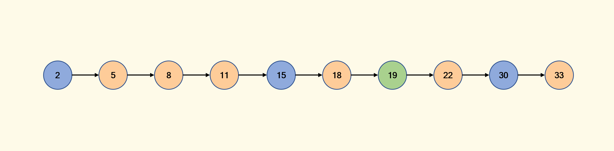

# Final Project of Multicore Processors: Architecture & Programming

## Abstract

## Introduction

In the realm of computer science and data structures, a hash table is a critical data structure that enables efficient data retrieval. In general, the hash table provides an average-case time complexity of $ O(1) $ for search, insert, and delete operations, making it an indispensable tool for applications that require quick data access. Hash tables achieve this efficiency by using a hash function to map keys to indices in an array, allowing for near-instantaneous data retrieval. However, in scenarios where hash conflicts are very serious, the time complexity of related operations may be very large. Our project is dedicated to solving this problem.

### What is a Hash Table?

A hash table, also known as a hash map, is a data structure that stores key-value pairs. It uses a hash function to compute an index into an array of buckets or slots, from which the desired value can be found. The hash function converts the key into a hash code, which is then compressed into an index suitable for the array's size. This process allows for rapid data access because it narrows down the search area to a specific index rather than searching through an entire dataset.

Hash tables are versatile and are used in various scenarios, including:

- Databases: For indexing data to allow quick retrieval.
- Caching Mechanisms: To store frequently accessed data for faster access.
- Symbol Tables: In compilers and interpreters to keep track of declared variables and their attributes.
- Networking: For routing tables and managing network resources.
- Applications with Constant-Time Lookup Requirements: Such as spell checkers, dictionaries, and language processing tools.

### Importance of Hash Tables

In today's data-driven world, the ability to store and retrieve data efficiently is more crucial than ever. Hash tables play a vital role in applications that require fast data access and manipulation. With the exponential growth of data, optimizing search and retrieval operations can significantly impact the performance and scalability of software systems. Hash tables offer a solution that balances speed and memory usage, making them essential for modern computing tasks.

As computing moves towards multi-core and distributed systems, parallel programming has become increasingly important. Hash tables, when adapted for parallelism, can greatly enhance the performance of concurrent applications. Implementing a hash table that supports multi-threaded operations involves addressing challenges such as synchronization, data consistency, and avoiding race conditions.

In a parallel environment, hash tables can be designed to allow multiple threads to perform operations simultaneously without interfering with each other. Techniques such as lock-free programming, fine-grained locking, and partitioning the hash table into segments (as in our implementation) are employed to achieve thread safety and improve performance. By enabling concurrent access, hash tables become more efficient and scalable in multi-threaded applications.

### Hash Collisions

A hash collision occurs when two different keys produce the same hash code using a hash function. In other words, the hash function maps multiple keys to the same index in the hash table. Since a hash table uses the hash code to determine where to store or retrieve a key-value pair, collisions can lead to ambiguity and potential errors in data retrieval.

Avoiding hash collisions is essential for maintaining the efficiency and reliability of a hash table. High collision rates can degrade the performance of the hash table from $ O(1) $ to $ O(n) $ in the worst case, where $ n $ is the number of elements in the table. This degradation occurs because the hash table must resolve collisions, often by traversing a list of colliding entries, which increases the time complexity of operations.

Furthermore, excessive collisions can lead to uneven distribution of data within the hash table, causing some slots to be overloaded while others remain unused. This imbalance not only affects performance but can also lead to increased memory usage and potential issues with thread contention in parallel implementations.

When hash collisions occur, the hash table must employ a collision resolution strategy to handle them. Common collision resolution techniques include:

- Chaining: Storing colliding elements in a linked list or another data structure at each index.
- Open Addressing: Finding another empty slot in the table through probing methods like linear probing, quadratic probing, or double hashing.
- Dynamic Array: Similar to Chaining, a dynamic capacity array, instead of the linked list, is used to store the data.

Literature Survey

–

## Proposed Idea

In designing efficient data structures for parallel computing, it's crucial to balance simplicity with performance. Our approach builds upon the fundamental characteristics of linked lists and integrates concepts inspired by skip lists to enhance search efficiency in a multi-threaded environment.

 Fig 1: A simple singly lined list. 

### What is a Skip List?

A skip list is a probabilistic data structure that allows fast search within an ordered sequence of elements. Invented by William Pugh in 1989, skip lists are an alternative to balanced trees, providing similar time complexities for operations but with simpler implementation and maintenance.

#### Structure of a Skip List

A skip list consists of multiple levels of linked lists:

- Levels: Each level in a skip list is a linked list that contains a subset of elements from the level below.
- Nodes: Each node may have multiple forward pointers, one for each level it appears in.
- Hierarchy: The bottom level (level 0) contains all the elements, forming a standard sorted linked list. Each higher level acts as an "express lane," allowing the algorithm to skip over multiple elements during search.

 Fig 2: A uniformly distributed constructed skip list equivalent to Fig 1. Blue path shows the search process for 19. 

#### How Skip Lists Work

- Insertion: When inserting a new element, it's randomly assigned a level. The element is then inserted into all levels up to its assigned level.
- Search:
  1. Start at the top level: Begin with the highest level of the skip list.
  2. Move forward: At each node, compare the target key with the key of the next node.
     - If the next key is less than or equal to the target, move to that node.
     - If the next key is greater, drop down one level and repeat.
  3. Terminate: Continue this process until the target is found or confirmed absent.
- Deletion: Similar to insertion, remove the node from all levels where it appears.

 Fig 3: A randomized probability distribution constructed skip list equivalent to Fig 1. Blue path here also shows the search process for 19. 

#### Time Complexity

- Search, Insert, Delete: $ O(\log n) $ average time complexity.
- Space Complexity: $ O(n) $.

#### Advantages of Skip Lists

- Simplicity: Easier to implement than balanced trees.
- Probabilistic Balancing: Avoids the need for strict balancing rules, as in AVL or Red-Black trees.
- Flexibility: Good performance for a wide range of operations without complex rebalancing.

### Our Concept: Segmented Singly Linked List

We found that many applications are read-intensive. So, our structure focus on accelerating search operations, which are critical for performance in such scenarios. Leveraging the simplicity of linked lists and inspired by the efficiency of skip lists, we propose a hash table with Segmented Singly Linked List data structure. Our implementation divides a standard singly linked list into several segments, with the starting node of each segment stored in a pivot array (referred to as `segments` in the code). This segmentation allows us to parallelize search operations by assigning each segment to a separate thread, significantly improving query speed in multi-threaded applications. Also, it greatly reduces the index maintenance required for insertion and deletion operations in the skip list. 

 Fig 4: Our implemented singly linkded list equivalent to Fig 1. Blue node here indicates the pivot node for segmentSize=3. 

#### Key Components:

- Singly Linked List: The foundational data structure, chosen for its simplicity and efficient insertion operations.
- Segments: The linked list is partitioned into segments of approximately equal size, determined by a predefined `segmentSize`.
- Pivot Array: An array (`segments`) that holds pointers to the starting node of each segment.
- Parallel Processing: Search operations are parallelized by assigning each segment to a separate thread using OpenMP.

### Detailed Operations

#### Insert Operation (`insertAtTail`)

The `insertAtTail` function adds a new node to the end of the linked list.

1. Node Creation: A new node is created with the given key and value.
2. Insertion:
   - If the list is empty (`tail` is `nullptr`), both `head` and `tail` point to the new node.
   - Otherwise, the new node is appended after the `tail`, and `tail` is updated to the new node.
3. Segment Maintenance:
   - The `size` of the list is incremented.
   - If the number of segments is less than the `segmentSize`, new segments are added.
   - If the list size exceeds the current segments, segments are adjusted to include new nodes.
   - We make sure that the valid segments all have the same size.

#### Remove Operation (`remove`)

The `remove` function deletes a node with the specified key from the linked list.

1. Search: Utilizes the `searchWithPrev` function to find the node to remove and its predecessor.
2. Deletion:
   - If the node is found, it's removed by adjusting the `next` pointer of the predecessor.
   - If the node is the `head`, the `head` is updated to the next node.
   - If the node is the `tail`, the `tail` is updated to the predecessor.
3. Segment Rebuilding:
   - After deletion, the `segments` vector is cleared and rebuilt to reflect the updated list structure.

#### Update Operation (`update`)

The `update` function modifies the value of a node with a given key.

1. Search: Calls the `search` function to locate the node.
2. Update:
   - If the node is found, its `value` is updated to the new value.
   - Returns `true` upon successful update.

#### Search Operation (`search` and `searchWithPrev`)

The `search` function locates a node with a specific key, while `searchWithPrev` also provides the predecessor node, useful for deletion.

1. Parallel Processing:
   - The list is divided into segments, each assigned to a thread using OpenMP's `#pragma omp parallel for`.
   - Each thread searches within its assigned segment.
2. Searching:
   - Each thread iterates through nodes in its segment.
   - If the key is found, a flag (`stop`) is set to terminate other threads' searches.
3. Synchronization:
   - A critical section (`#pragma omp critical`) ensures that only one thread updates the result at a time.
   - The search stops early if another thread has already found the key.

### Analysis of Our Implementation

Our implementation offers several performance benefits over traditional singly linked lists and even some other parallel data structures:

1. Improved Search Performance:
   - By parallelizing the search operation across multiple segments, we reduce the time complexity from $ O(n) $ to $ O(n/p) $, where $ p $ is the number of threads (segments).
   - The use of segments allows each thread to work independently. By dividing the list into segments and processing them in parallel, we exploit the full potential of multi-core systems, which minimizing contention.

2. Simplicity and Maintainability:
   - Retains the simplicity of a singly linked list, making it easy to understand and maintain.
   - Segment management adds minimal overhead to insertion and deletion operations.
   - Since each thread operates on a different segment, there's minimal need for synchronization, reducing overhead.

3. Scalability:
   - The approach scales with the number of available processors.
   - As the data size grows, more segments (and thus threads) can be utilized to maintain performance.

4. Flexibility:
   - The `segmentSize` can be adjusted based on the application requirements and hardware capabilities.
   - The structure can be extended or modified for additional functionalities as needed.

Experimental Setup

–

Experiments & Analysis

–

Conclusions

–

References

https://writings.sh/post/data-structure-skiplist